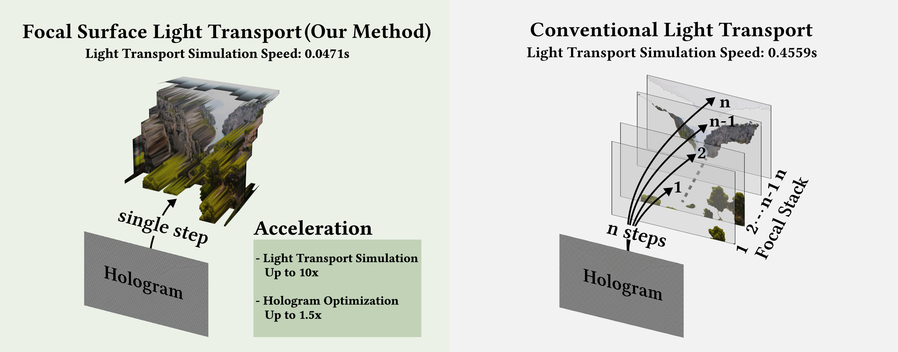
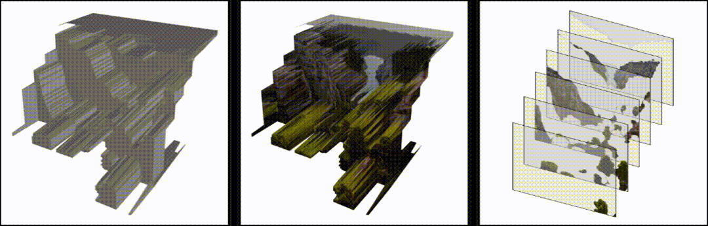

# Focal Surface Holographic Light Transport using Learned Spatially Adaptive Convolutions

[Chuanjun Zheng](https://scholar.google.com.hk/citations?user=9Jk_LC8AAAAJ&hl=zh-CN), [Yicheng Zhan](https://scholar.google.com/citations?hl=zh-CN&user=x2ptSYUAAAAJ), [Liang Shi](https://people.csail.mit.edu/liangs/), [Ozan Cakmakci](https://scholar.google.com/citations?user=xZLjeAMAAAAJ&hl=en), [Kaan Akşit](https://kaanaksit.com) 






[Project Site](https://complightlab.com/publications/focal_surface_light_transport/)
[Arxiv](https://arxiv.org/abs/2410.06854)
[Manuscript](https://kaanaksit.com/assets/pdf/ZhengEtAl_SigAsia2024_Focal_surface_holographic_light_transport_using_learned_spatially_adaptive_convolutions.pdf)
[Supplementary](https://kaanaksit.com/assets/pdf/ZhengEtAl_SigAsia2024_Supplementary_Focal_surface_holographic_light_transport_using_learned_spatially_adaptive_convolutions.pdf)

## Getting started

### (0) Requirments

Please make sure to have the right dependencies installed.
```bash
pip3 install -r requirements.txt
```
Install the latest version of Odak.
```bash
git clone git@github.com:kaanaksit/odak.git
cd odak
pip3 install -r requirements.txt
pip3 install -e .
```
### (1) Testing
You can start testing using the following syntax:
 

#### (1.1)  Default test
```bash
git clone git@github.com:complight/focal_surface_holographic_light_transport.git
cd focal_surface_holographic_light_transport
python test.py  
```
After running the script, you can find the output in the `test_output` directory. The primary result of the test will be the reconstructed image, which will be saved as `reconstruction_image.png`. 
#### (1.2) Customizing the test
If you would like to test with a different focal surface file or change the output directory, you can specify these as arguments when running the script:
```bash
python test.py --focal_surface_filename ./path/to/your/focal_surface.png --hologram_phase_filename ./path/to/your/hologram.png --output_directory ./path/to/output
```

### (2) Training
#### (2.1) Preparing your dataset

We strongly encourage you to refer to the previous work of our group,
[multicolor](https://github.com/complight/multicolor), to generate the
dataset based on your own settings. Alternatively, you can directly
use `odak.learn.wave.multi_color_hologram_optimizer`.

#### (2.2) Revising the settings


Please consult the settings file found in `sample_zero.txt`, where you will find a list of self descriptive variables that you can modify according to your needs.
This way, you can create a new settings file or modify the existing one.

#### (2.3) Starting training

```shell
python main.py 
```

## Support
For more support regarding the code base, please use the issues section of this repository to raise issues and questions.


# Citation
If you find our work useful in your research, please consider citing:

```bibtex
@inproceedings{zheng2024focalholography,
  title={Focal Surface Holographic Light Transport using Learned Spatially Adaptive Convolutions},
  author={Chuanjun Zheng, Yicheng Zhan, Liang Shi, Ozan Cakmakci, and Kaan Ak{\c{s}}it},
  booktitle = {SIGGRAPH Asia 2024 Technical Communications (SA Technical Communications '24)},
  keywords = {Computer-Generated Holography, Light Transport, Optimization},
  location = {Tokyo, Japan},
  series = {SA '24},
  month={December},
  year={2024},
  doi={https://doi.org/10.1145/3681758.3697989}
}
```
