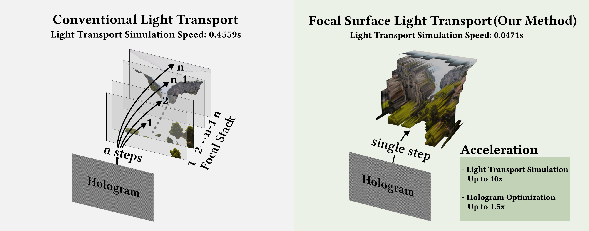

# Focal Surface Holographic Light Transport using Learned Spatially Adaptive Convolutions

[Chuanjun Zheng](https://scholar.google.com.hk/citations?user=9Jk_LC8AAAAJ&hl=zh-CN), [Yicheng Zhan](https://scholar.google.com/citations?hl=zh-CN&user=x2ptSYUAAAAJ), [Liang Shi](https://people.csail.mit.edu/liangs/),[Ozan Cakmakci](https://scholar.google.com/citations?user=xZLjeAMAAAAJ&hl=en),[Kaan Akşit](https://kaanaksit.com) 



[Project site](https://complightlab.com/publications/focal_surface_light_transport/)
[Arxiv](https://arxiv.org/abs/2410.06854)
[Manuscript](https://kaanaksit.com/assets/pdf/ZhengEtAl_SigAsia2024_Focal_surface_holographic_light_transport_using_learned_spatially_adaptive_convolutions.pdf)
[Supplementary](https://kaanaksit.com/assets/pdf/ZhengEtAl_SigAsia2024_Supplementary_Focal_surface_holographic_light_transport_using_learned_spatially_adaptive_convolutions.pdf)

## Getting started

### (0) Requirments


### (0) Requirments

Please make sure to have the right dependencies installed.
```bash
pip3 install -r requirements.txt
```

### (2) Testing
Start testing by by providing the below syntax:

```bash
git clone git@github.com:complight/focal_surface_holographic_light_transport.git
cd focal_surface_holographic_light_transport
python test.py  
```


# Citation
```bibtex
        @inproceedings{zheng2024focalholography,
          title={Focal Surface Holographic Light Transport using Learned Spatially Adaptive Convolutions},
          author={Chuanjun Zheng, Yicheng Zhan, Liang Shi, Ozan Cakmakci, and Kaan Ak{\c{s}}it},
          booktitle = {SIGGRAPH Asia 2024 Technical Communications (SA Technical Communications '24)},
          keywords = {Computer-Generated Holography, Light Transport, Optimization},
          location = {Tokyo, Japan},
          series = {SA '24},
          month={December},
          year={2024},
          doi={https://doi.org/10.1145/3681758.3697989}
        }
```
